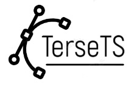

# 

# TerseTS
TerseTS is a library that provides methods for lossless and lossy compressing time series. To match existing literature the methods are organized based on [Time Series Compression Survey](https://dl.acm.org/doi/10.1145/3560814). The library is implemented in Zig and provides a C-API with [bindings](#Installation) for other languages.

# Installation
TerseTS can be compiled and cross-compiled from source:
1. Install the latest version of [Zig](https://ziglang.org/)
2. Build TerseTS for development in `Debug` mode using Zig, e.g.,:
   - Linux: `zig build -Dtarget=x86_64-linux`
   - macOS: `zig build -Dtarget=aarch64-macos`
   - Microsoft Windows: `zig build -Dtarget=x86_64-windows`
3. Build TerseTS for deployment in `ReleaseFast`, `ReleaseSafe`, and `ReleaseSmall` mode using Zig, e.g.,:
   - Linux: `zig build -Dtarget=x86_64-linux -Doptimize=ReleaseFast`
   - macOS: `zig build -Dtarget=aarch64-macos -Doptimize=ReleaseFast`
   - Microsoft Windows: `zig build -Dtarget=x86_64-windows -Doptimize=ReleaseFast`

# Usage
TODO

# Bindings
TerseTS provides a C-API that is designed to be simple to wrap. Currently, TerseTS includes bindings for the current programming languages which can be used without installation of any dependencies:
- [Zig](tersets/capi.zig)
- [C](tersets/capi.zig)
- [C++](tersets/capi.zig) 
- [Python](bindings/tersets.py) using [ctypes](https://docs.python.org/3/library/ctypes.html)

# License
TerseTS is licensed under version 2.0 of the Apache License and a copy of the license is bundled with the program.