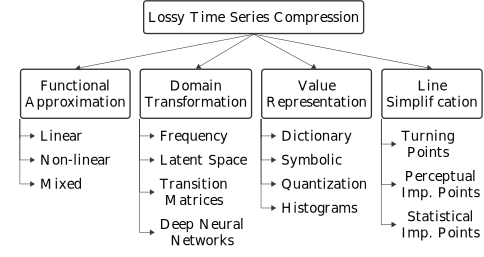

<h1 align="center">
  
</h1>

TerseTS is a library that provides methods for lossless and lossy compressing time series. To match existing literature, the lossy compression methods are organized in the hierarchy below based on [Time Series Compression Survey](https://dl.acm.org/doi/10.1145/3560814). Each category represents a distinct approach to time series compression. The library is implemented in Zig and provides a Zig-API and C-API with [bindings](#usage) for other languages.

<p align="center">
   
   <br>
   <em>Figure: Hierarchical organization of lossy time series compression techniques.</em>
</p>


# Compilation
TerseTS can be compiled and cross-compiled from source:
1. Download the latest version of [Zig](https://ziglang.org/).
2. Build TerseTS for development in `Debug` mode using Zig, e.g.,:
   - Linux: `zig build -Dtarget=x86_64-linux`
   - macOS: `zig build -Dtarget=aarch64-macos`
   - Microsoft Windows: `zig build -Dtarget=x86_64-windows`
3. Build TerseTS for deployment in `ReleaseFast`, `ReleaseSafe`, and `ReleaseSmall` mode using Zig, e.g.,:
   - Linux: `zig build -Dtarget=x86_64-linux -Doptimize=ReleaseFast`
   - macOS: `zig build -Dtarget=aarch64-macos -Doptimize=ReleaseFast`
   - Microsoft Windows: `zig build -Dtarget=x86_64-windows -Doptimize=ReleaseFast`

# Usage
TerseTS provides a Zig-API and a C-API that is designed to be simple to wrap. The C-API exposes two main data structures for C interoperability:

* `struct UncompressedValues`: Represents a read-only view of the input time series data composed of:
   * `data`: Pointer to an array of double-precision values (`const double *`).
   * `len`: Number of values in the array (`size_t`).

* `struct CompressedValues`: Represents a buffer for compressed data composed of:
   * `data`: Pointer to an array of compressed bytes (`uint8_t *`).
   * `len`: Number of bytes in the buffer (`size_t`).

These structures are used as arguments to the compression and decompression functions, allowing efficient transfer of data between C, Zig, and other language bindings. The following programming languages can be used without installation of any dependencies:

<a id="zig-usage-example"></a>
<details>
<summary><strong>Zig Usage Example</strong></summary>

TerseTS provides `./src/tersets.zig` as the single access point and two main functions `compress()` and `decompress()`.

- **`compress(allocator: Allocator, uncompressed_values: []const f64, method: Method, configuration: []const u8) Error!ArrayList(u8)`:**
   - **Parameters:**
      - `allocator: std.mem.Allocator`: Allocator instance used to allocate memory for the returned. 
      - `uncompressed_values: []const f64`: A sequence of double-precision floating points representing the data to compress.
      - `method: Method`: Compression method identifier from the `tersets.Method` enum (e.g., `tersets.Method.SwingFilter`).
      - `configuration: []const u8`: A JSON string specifying compression parameters (e.g., `"{ \"abs_error_bound\": 0.1 }"`).
   - **Returns:** The function returns an `Error!ArrayList(u8)` which includes a dynamically allocated `compressed_values: ArrayList(u8)` or a `TerseTS.Error` in case failure. 

- **`decompress(allocator: Allocator, compressed_values: []const u8) Error!ArrayList(f64)`:**
   - **Parameters:**
      - `allocator: std.mem.Allocator`: Allocator instance used to allocate memory for the returned `decompressed_values`.
      - `compressed_values: []const u8`: The compressed data to decompress.
   - **Returns:** The function returns an `Error!ArrayList(f64)` which includes a dynamically allocated `decompressed_values` (of type `ArrayList(f64)`) or a `TerseTS.Error` in case of failure. 

Below is a usage example demonstrating how to use the TerseTS Zig API for compressing and decompressing time series data.

```c
const std = @import("std");
const tersets = @import("path/to/tersets.zig");
const gpa = std.heap.GeneralPurposeAllocator(.{}){};
const allocator = gpa.allocator();

pub fn main() void {
   var uncompressed_values = [_]f64{1.0, 2.0, 3.0, 4.0, 5.0};
   std.debug.print("Uncompressed data length: {any}\n", .{uncompressed_values.len});

   // Configuration for compression.
   // The supported compression methods are specified in tersets.zig.
   // The supported configuration are specified in config.zig.
   const method = tersets.Method.SwingFilter;
   const configuration = "{ \"abs_error_bound\": 0.1 }";

   // Compress the data.
   var compressed_values = try tersets.compress(allocator, uncompressed_values, method, configuration);
   // The compressed values point to dynamically allocated data that should be deallocated.
   defer compressed_values.deinit();

   std.debug.print("Compression successful. Compressed data length: {any}\n", .{compressed_values.items.len});

   // Decompress the data.
   var decompressed_values = try tersets.decompress(allocator, compressed_values);
   // The decompressed values point to dynamically allocated data that should be deallocated.
   defer decompressed_values.deinit();

   std.debug.print("Decompression successful. Decompressed data length {any}\n", .{decompressed_values.items.len});
}
```

</details>

<a id="c-usage-example"></a>
<details>
<summary><strong>C Usage Example</strong></summary>

TerseTS provides `./bindings/c/tersets.h` as API for C which should be included in the source code, i.e., `#include "tersets.h"`. The TerseTS library must also be [linked](#linking) to the project. The two main functions `compress()` and `decompress()` are exposed as follow: 

- **`int32_t compress(struct UncompressedValues uncompressed_values, struct CompressedValues *compressed_values, uint8_t method, const char *configuration)`:**
   - **Parameters:**
      - `struct UncompressedValues uncompressed_values`: The array of values to compress.
      - `struct CompressedValues *compressed_values`: A pointer to a structure where the compressed values will be stored. The memory is dynamically allocated and must be freed using `freeCompressedValues()`
      - `uint8_t method`: Compression method identifier from the `Method` enum (e.g., `SwingFilter`).
      - `const char *configuration`: A JSON string specifying compression parameters (e.g., `"{\"abs_error_bound\": 0.01}"`).
   - **Returns:** An integer indicating success `(0)` or an error code from `tersets.Error`. 

- **`int32_t decompress(struct CompressedValues compressed_values, struct UncompressedValues *uncompressed_values)`:**
   - **Parameters:**
      - `struct CompressedValues compressed_values`: The compressed data to decompress.
      - `struct UncompressedValues * uncompressed_values`: A pointer to a structure where the decompressed values will be stored. The memory is dynamically allocated and must be freed using `freeUncompressedValues()`.
   - **Returns:** An integer indicating success `(0)` or an error code from `tersets.Error`.

Compression methods are listed in the `Method` enum in the header file `tersets.h`. Below is a usage example demonstrating how to use the TerseTS C API for compressing and decompressing time series data.


```c
#include "tersets.h"
#include <stdio.h>

int main(void) {
    // Input data.
    double data[] = {1.0, 2.0, 3.0, 4.0, 5.0};
    struct UncompressedValues uncompressed_values = { data, 5 };

    printf("Uncompressed data length: %zu\n", uncompressed_values.len);

    // Configuration for compression.
     const char *configuration = "{\"abs_error_bound\": 0.01}";
     enum Method method = SwingFilter;

    // Output buffers for compressed/decompressed data.
    struct CompressedValues   compressed_values = {0};
    struct UncompressedValues decompressed_values = {0};

    // Compression. The C API mirrors the `Method` enum from TerseTS.
    int32_t result = compress(uncompressed_values, &compressed_values, method, configuration);
    if (result != 0) {
        printf("Compression failed with error code %d\n", result);
        return -1;
    }

    printf("Compression successful. Compressed length: %zu bytes\n",
           compressed_values.len);

    // Decompression.
    result = decompress(compressed_values, &decompressed_values, config);
    if (result != 0) {
        printf("Decompression failed with error code %d\n", result);
        freeCompressedValues(&compressed_values);
        return -1;
    }

    printf("Decompression successful. Decompressed length: %zu values\n",
           decompressed_values.len);

    // Cleanup.
    freeUncompressedValues(&decompressed_values);
    freeCompressedValues(&compressed_values);
    return 0;
}
```


   
</details>

<a id="python-usage-example"></a>
<details>
<summary><strong>Python Usage Example</strong></summary>

TerseTS provides Python bindings located in `./bindings/python/tersets/__init__.py`, which can be directly imported into a Python program using `import tersets`. To install the bindings, navigate to the Python binding root directory and run `pip install .` as described in the [Python bindings README](bindings/python/README.md). The bindings automatically load the native library.


- **`compress(values, method, configuration)`:**
   - **Parameters:**
      - `values`: A list, tuple, or `numpy.ndarray` of floats representing the data to compress. `numpy.ndarray` is faster as they can be compressed without creating a copy.
      - `method`: An enum value from `tersets.Method` specifying the compression method.
      - `configuration`: A dictionary or JSON string specifying compression parameters (e.g., `{"abs_error_bound": 0.1}`).
   - **Returns:** Compressed data as bytes or an error raised as a Python exception.

- **`decompress(values)`:**
   - **Parameters:**
      - `values`: The compressed data as `bytes`, `bytearray`, or `memoryview` to decompress.
   - **Returns:** Decompressed values as a Python list of floats or an error are raised as a Python exception.. 

All dynamically allocated memory is deallocated internally in a safe way.

```python
import random
import sys
from tersets import compress, decompress, Method

uncompressed_values = [1.0, 2.0, 3.0, 4.0, 5.0]

# Configuration for compression.
# The supported compression methods are specified in tersets.zig.
method = Method.SwingFilter
configuration = {"abs_error_bound": 0.1}

print("Uncompressed data length: ", len(uncompressed_values))

# The supported compression methods are specified in tersets.zig.
# The Python-API provides a `Method` enum to access the available methods.
# Compress the data.
compressed_values = compress(uncompressed_values, method, configuration)

print("Compression successful. Compressed data length: ", len(compressed_values))

# Decompress the data.
decompressed_values = decompress(compressed_values)

print("Decompression successful. Decompressed data length: ", len(decompressed_values))
```


</details>


# Linking:
- **Microsoft Windows**: Link the `tersets.dll` to the project. It can be found in the output folder after compiling TerseTS, by default: `zig-out/lib/tersets.dll`.
- **Linux**: Link the `tersets.so` to the project. It can be found in the output folder after compiling TerseTS, by default: `zig-out/lib/tersets.so`.
- **macOS**: Link the `tersets.dylib` to the project. It can be found in the output folder after compiling TerseTS, by default: `zig-out/lib/tersets.dylib`.

# Contributing:  
Please read our [contributing guidelines](.github/CONTRIBUTING.md) before submitting an [issue](https://github.com/cmcuza/TerseTS/issues/new/choose) or a [pull request](https://github.com/cmcuza/TerseTS/compare).

# License
TerseTS is licensed under version 2.0 of the Apache License and a copy of the license is bundled with the program.
